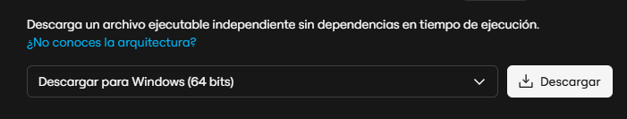
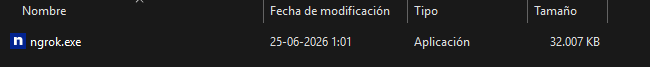

# Guía de arranque — Patiperro

Pasos para correr la aplicación en **localhost** con túneles **Cloudflare** + **ngrok** (obligatorios para pagos con Mercado Pago).

**Primera vez:** crear las 9 BD en PostgreSQL, levantar microservicios una vez (tablas) y ejecutar seeds en [datos-iniciales-bd.md](datos-iniciales-bd.md).

**Descargar antes:**

- [Cloudflare Tunnel](https://developers.cloudflare.com/cloudflare-one/connections/connect-networks/downloads/) (`cloudflared.exe`)
- [ngrok](https://ngrok.com/download)

---

## Paso 1 — Crear `.env.local` en el frontend

Archivo: `frontend/patiperro-project/.env.local`

```properties
VITE_API_BASE_URL=proxy

VITE_PUBLIC_APP_URL=
```

---

## Paso 2 — Iniciar el frontend

```powershell
cd frontend\patiperro-project
npm install
npm run dev
```

---

## Paso 3 — Túnel Cloudflared

Antes se debe de instalar el "ejecutable" de Cloudflared: https://developers.cloudflare.com/cloudflare-one/networks/connectors/cloudflare-tunnel/downloads/
y guardarlo en una carpeta llamado "cloudflared".

Luego se abre esa carpeta en la terminal y se ejecuta:

Carpeta de `cloudflared.exe` → clic derecho → **Abrir en terminal**:

```powershell
.\cloudflared.exe tunnel --url http://localhost:5173
```

---

## Paso 4 — Copiar URL de Cloudflare

Ejemplo: `https://sales-texas-point-follows.trycloudflare.com` (sin `/` final).

---

## Paso 5 — Pegar URL en el frontend

`frontend/patiperro-project/.env.local` → propiedad **`VITE_PUBLIC_APP_URL`**:

Si .env.local no existe en la raiz del frontend, hay que crearlo manualmente

```properties
VITE_API_BASE_URL=proxy

VITE_PUBLIC_APP_URL=https://sales-texas-point-follows.trycloudflare.com
```

Reiniciar Vite (`Ctrl+C`, `npm run dev`).

---

## Paso 6 — Pegar URL en pagos-service

`backend/pagos-service/src/main/resources/application-dev.properties` → **`patiperro.mercadopago.checkout.public-front-base-url`**:

LAs url que se muestran son un ejemplo de ls url que entrega cloudflare, ya que son proporcionadas de manera aleatoria cada vez que se inicia cloduflare

```properties
patiperro.mercadopago.checkout.public-front-base-url=https://sales-texas-point-follows.trycloudflare.com
```

---

## Paso 7 — Pegar URL en api-gateway

Copiar `backend/api-gateway/.env.local.example` → `backend/api-gateway/.env.local` y pegar la misma URL al final:

```properties
GATEWAY_EXTRA_CORS_ORIGINS=patiperro.mercadopago.checkout.public-front-base-url=https://sales-texas-point-follows.trycloudflare.com
```

> La URL de Cloudflare va en **3 lugares**: pasos 5, 6 y 7.

---

## Paso 8 — ngrok

Antes se debe de descargar Ngrok en tu sistema operativo: https://ngrok.com/download/windows?tab=download




Luego se ejecuta el archivo dentro de la carpeta descargada que te entrega el sitio al descargarlo:



Y después se abre la terminal de ngrok y se ejecuta el siguiente comando:

```powershell
ngrok http 8080
```

Luego la URL que te proporciona se tiene que pegar en las siguientes ubicaciones:

En `application-dev.properties`, webhook (URL ngrok + path):

```properties
patiperro.pagos.checkout.notification-url=https://TU-NGROK.ngrok-free.dev/api/pagos/webhooks/mercadopago
patiperro.mercadopago.checkout.notification-url=https://TU-NGROK.ngrok-free.dev/api/pagos/webhooks/mercadopago
```

Reiniciar `pagos-service` y `api-gateway`.

---

## Paso 9 — Microservicios

Levantar: `api-gateway` (8080), `tutores-service` (8081), `paseadores-service` (8082), `mascotas-service` (8083), `agenda-service` (8084), `reserva-service` (8090), `notification-service` (8086), `pagos-service` (8087), `resena-service` (8088), `chat-service` (8089).

Launchers: `.vscode/launch.json`.

---

## Paso 10 — Abrir la app

Navegador → **URL HTTPS de Cloudflare** del paso 4 (no `localhost:5173`).
